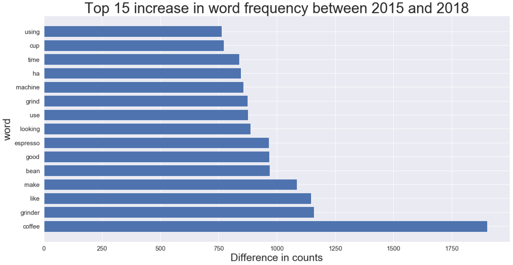
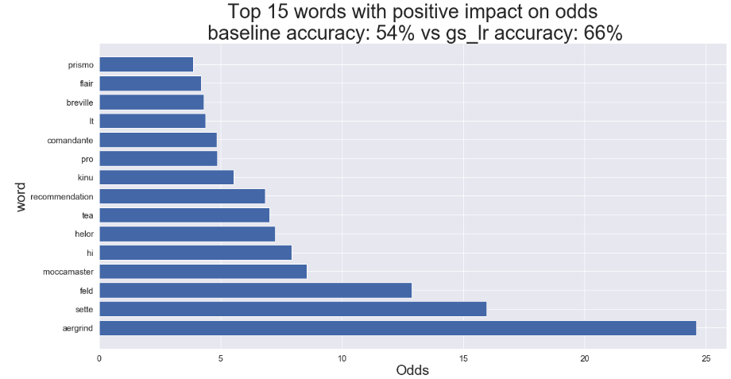
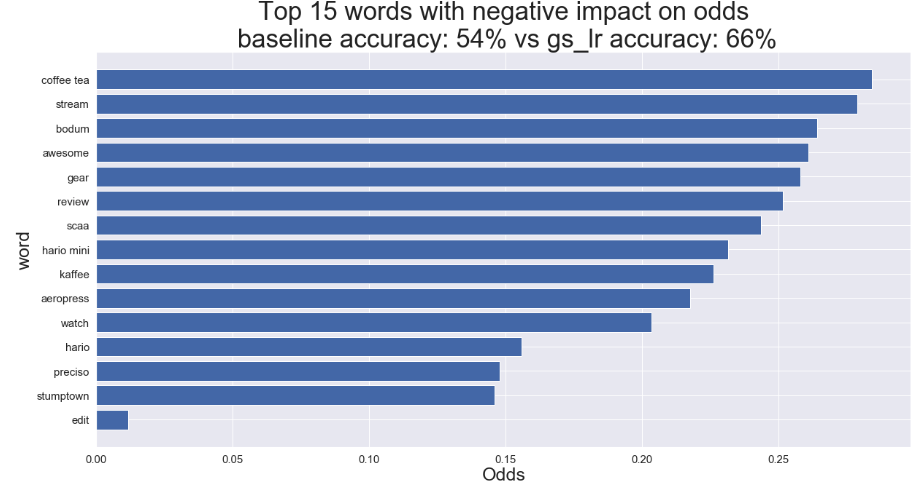
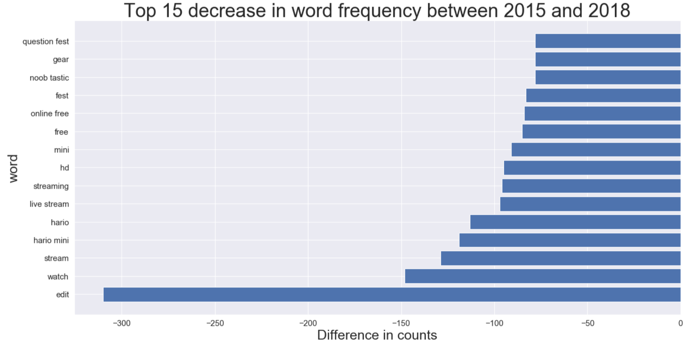

# Reddit Analysis of Coffee Subreddit

## Executive Summary

### Problem Statement

Coffee consumption around the U.S. has risen to 64% from 62% in 2017. Although many consume their coffee via stores such as Starbucks, according to a survey conducted by Reuters to 3000 people, 79% of people said that they had had a cup of coffee at home the previous day. Retailers such as Bed Bath and Beyond and Crate and Barrel sell household items ranging from bed sheets to hair dryers. They also sell coffee related products such as machines, grinders and more. For retailers that want to refresh their coffee related product offerings, I conducted an Natural Language Processing analysis to classify which products are trendy and not trendy. It goes without saying that retailers should attune to customer's desires to generate more sales. I explored models such as the Naive Bayes, logistic regression, and Random Forest Tree models to buttress my conclusion. The logistic regression model was put into production due to its easily interpretable coefficients as well as its better performance in the precision and accuracy metric against the baseline model.   

(source: https://www.reuters.com/article/us-coffee-conference-survey/americans-are-drinking-a-daily-cup-of-coffee-at-the-highest-level-in-six-years-survey-idUSKCN1GT0KU)

### Description of Data

The data used in this analysis was through Reddit. I utilized the Pushshift API in order to extract contents from the Coffee subreddit. The subreddit has more than 200K subscribers and has an active user base. I focused on the years 2015 and 2018 and used 2018 as my positive class or 'trendy' coffee topics.  I also only focused on the title and selftext within each post. Posts that were removed by the moderator or deleted by the original poster were removed from the analysis to avoid injecting superfluous noise in my models.  

Data source: (https://www.reddit.com/r/Coffee/)

### Target

The primary focus of this project was to become more familiar with text data and natural language processing via classification modeling techniques such as logistic regression and random forest trees models.

### Assumptions

It is important to preface my model outputs and hence my conclusions with the fact that I considered text frequency (a.k.a. attention among individuals) with positive semantics (right diction?). For example, if a post included the word such as 'breville', a coffee maker, I assumed that it discusses the word in a positive light and ignoring hypothetical posts such as 'I hate the breville coffee maker!'.  

### Trend in Coffee subreddit
**Overall change in the contents of posts between the years 2015 and 2018:**

The above chart demonstrates increased use of the words such as 'coffee', 'grinder', 'bean', 'espresso', all closely related to coffee. I make the inference that people continue to consume coffee (a.k.a. pleasantly suffer from caffeine addiction). Retailers should take note of this sustained and increased consumer base of caffeine and tailor their product offerings accordingly. 

### Model Coefficients

**Positive impact on odds**

| feature | weights | odds |
| --- | --- | --- |
| aergrind | 3.20 |24.61|
| sette | 2.77 |15.95|
| feld | 2.56 |12.88|
| moccamaster | 2.15 |8.56|
| hi | 2.07 |7.93|
| helor | 1.98 |7.25|
| tea | 1.95 |7.04|
| recommendation | 1.92 |6.84|
| kinu | 1.71 |5.54|
| pro | 1.59 |4.88|
| comandante | 1.58 |4.85|
| lt | 1.48 |4.38|
| breville | 1.46 |4.32|
| flair | 1.44 |4.21|
| prismo | 1.36 |3.88|

The above chart can be interpreted as the following: if a post includes words such as 'sette, moccamaster', the odds of the post being classified into the positive class  (recall that the positive class for this analysis is being trendy/'in' or in 2018) is ~16 and ~9 times as likely, respectively.

**Negative impact on odds**

| feature | weights | odds |
| --- | --- | --- |
| edit | -4.44 |0.01|
| stumptown | -1.92 |0.15|
| preciso | -1.91 |0.15|
| hario | -1.86 |0.16|
| watch | -1.59 |0.20|
| aeropress | -1.52 |0.22|
| kaffee | -1.49 |0.23|
| hario mini | -1.46 |0.23|
| scaa | -1.41 |0.24|
| review | -1.38 |0.25|
| gear | -1.35 |0.26|
| awesome | -1.34 |0.26|
| bodum | -1.33 |0.26|
| stream | -1.28 |0.28|
| coffee tea | -1.26 |0.28|

Coefficient weights (first column) from a logistic regression model should be exponentiated to properly interpret as an increase or decrease in odds (second column). Odds lower than 1 decrease the likelihood that it will be classified into the positive class .

Contrary to the previous chart, the above chart displays the decrease in likelihood being classified into the positive class. For example, if posts include the words 'hario' or 'hario mini', the odds of being classified into the positive class is ~0.15 and ~0.23 as likely. 

### Conclusions and Recommendations

With retailers looking to evaluate their current coffee related product offerings, I set out to provide recommendations on how they can best appease today's demanding consumers' desires. Through natural language processing concepts, I sought out to build a model that best classifies a given post into the appropriate class with the highest accuracy. From the models explored, namely Naive Bayes, logistic regression, and random forest trees, the logistic regression model was ultimately put into production due to its outperformance in accuracy versus the baseline model and ease of interpretation.

From the model coefficients and its appropriate interpretation from the previous section, I recommend that if retailers do not offer the sette and moccamaster coffee grinders, it should stock up on those devices to best tailor to recent customer desires. Conversely, if retailers currently offer the hario or hario mini grinders, it should discontinue doing so. To further buttress the latter half of my recommendation, below is a plot that graphs the difference in the number of occurences of words in posts from 2015 compared to those in 2018. Included in the top 5 largest decrease between the two timeframes are 'hario mini' and 'hario' which are coffee grinders. In other words, people discussed the two grinders less in 2018; therefore, it passes my sanity check that posts that mention the two grinders decrease the odds of it being classified into the positive class.

### Going Forward

As stated in the assumptions, semantic analysis of how individuals talk about the devices may alter my conclusion. For example, if people were talking about how awful the sette and moccamaster were, then retailers should ultimately ignore my conclusion to switch their offerings of said coffee grinders. Again, conversely, another example is that if people in the Coffee Subreddit talked about the hario and hario mini in a negative tone, then the decrease in frequency of such posts is in fact good. Such example again buttresses the importance of the assumption made in the beginning and its impact in my findings and recommendations.I would also liked to have conducted some sort of time series analysis to truly predict upcoming trends, for my current analysis concludes what was in trend for the year of 2018 and not 2019.